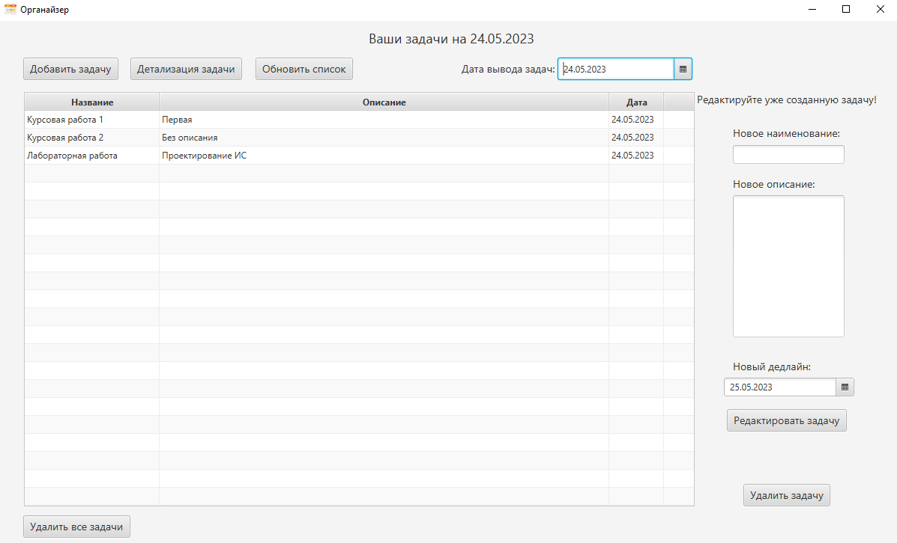
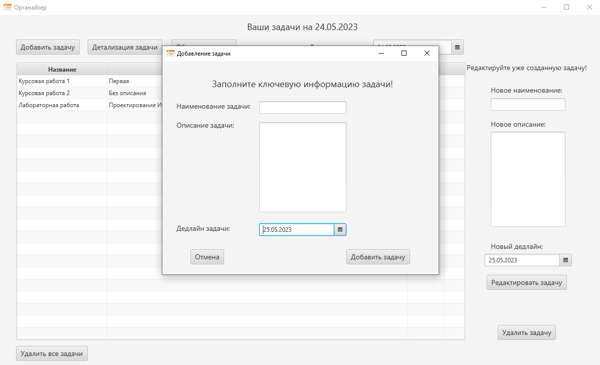
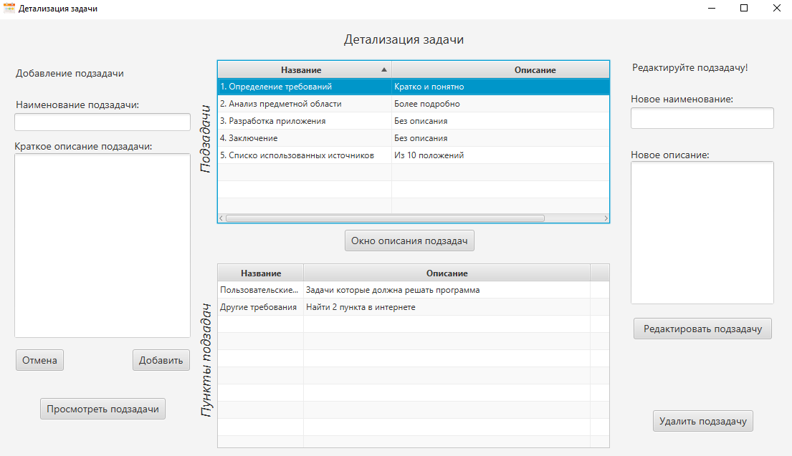
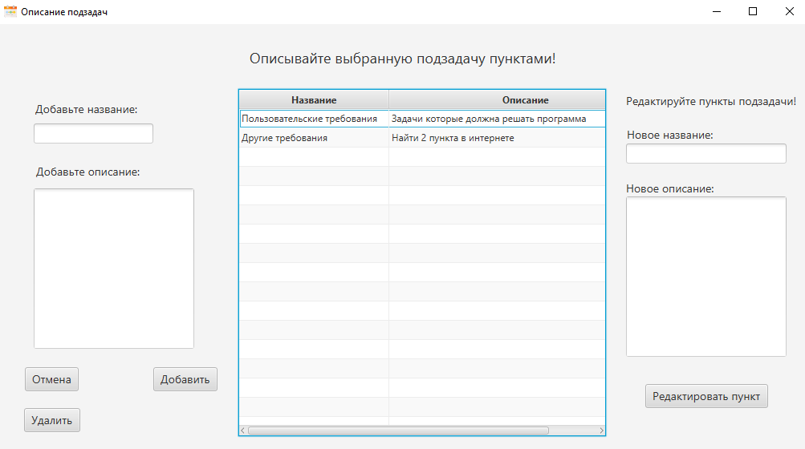

# Программный продукт "Органайзер студента"
В рамках данного курсового проект была разработана программа “Органайзер студента”, которая позволит студентам легко и быстро управлять своим рабочим временем и задачами.
С её помощью возможны: добавление/редактирование/удаление задач, детализация задач на подзадачи, а подзадачи на пункты, просмотр задач по дате, работа с подзадачами и пунктами.
Также для приложения были сгенерированы javadocs, с которыми можно ознакомится в [папке](https://github.com/Sergej-G/Student-Organaizer-TaskMaster/tree/master/JavaDocs). 

## Интерфейс программы
Главное окно

Окно добавления задачи

Окно детализации задачи

Окно описания подзадачи в виде пунктов

## Средства разработки
Для создания GUI был использован JavaFx. В качестве базы данных была использована PostgreSQL.
